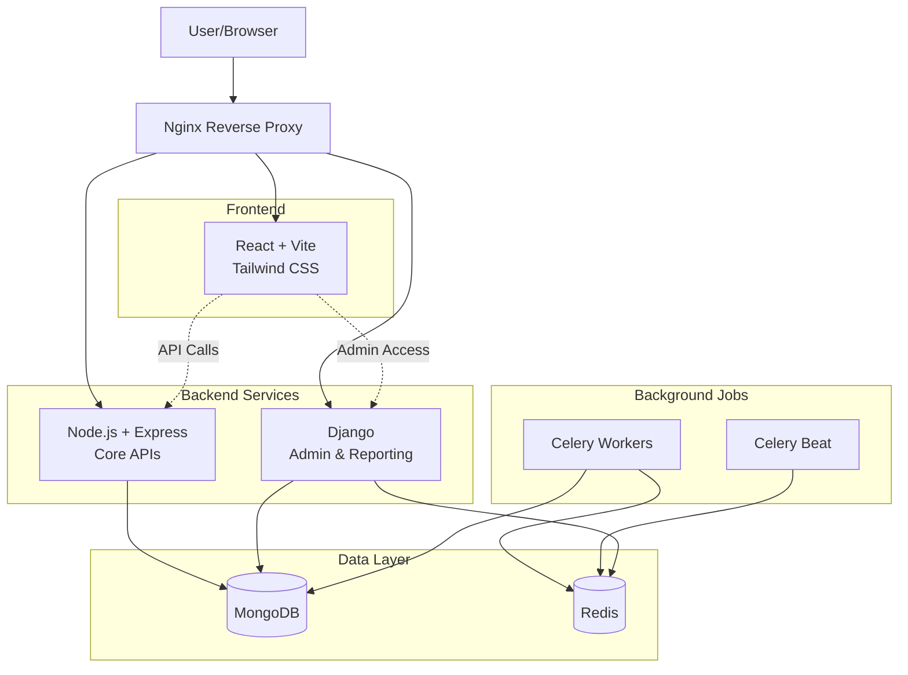

# Cartora Architecture

## System Overview

Cartora is a modern e-commerce platform built with microservices architecture, leveraging cutting-edge technologies for scalability, maintainability, and performance.

## Architecture Diagram



## Component Breakdown

### Frontend Layer

**Technology**: React 18 + Vite + Tailwind CSS

- **Responsibilities**:
  - User interface and experience
  - Client-side routing
  - State management
  - API integration
  
- **Key Features**:
  - Server-side rendering ready with Vite
  - Responsive design with Tailwind
  - Modern React patterns (Hooks, Context)
  - Optimized build pipeline

### Backend Services

#### Node.js API Service

**Technology**: Express.js + MongoDB + Mongoose

- **Responsibilities**:
  - RESTful API endpoints
  - User authentication (JWT)
  - Product management
  - Order processing
  - Real-time features
  
- **API Structure**:
  ```
  /api/auth      - Authentication endpoints
  /api/users     - User management
  /api/products  - Product CRUD
  /api/orders    - Order processing
  ```

#### Django Admin Service

**Technology**: Django + djongo + Django REST Framework

- **Responsibilities**:
  - Admin interface
  - Report generation
  - Background job orchestration
  - Data analytics
  
- **Features**:
  - Custom Django admin
  - Celery task management
  - Job logging and monitoring
  - Scheduled reports

### Data Layer

#### MongoDB

**Purpose**: Primary database for all services

- **Collections**:
  - `users` - User accounts and profiles
  - `products` - Product catalog
  - `orders` - Order history
  - `reports` - Generated reports
  - `job_logs` - Background job logs

#### Redis

**Purpose**: Caching and message broker

- **Use Cases**:
  - Celery task queue
  - Session storage
  - API response caching
  - Rate limiting

### Background Jobs

#### Celery Workers

- **Purpose**: Execute asynchronous tasks
- **Tasks**:
  - Report generation
  - Email notifications
  - Data exports
  - Inventory updates

#### Celery Beat

- **Purpose**: Scheduled task execution
- **Examples**:
  - Daily sales reports
  - Weekly inventory checks
  - Monthly analytics

### Infrastructure Layer

#### Nginx

- **Purpose**: Reverse proxy and load balancer
- **Routes**:
  - `/` → Frontend (React)
  - `/api/` → Backend Node.js
  - `/admin/` → Backend Django
  
- **Features**:
  - SSL termination (production)
  - Request caching
  - Load balancing
  - Security headers

#### Docker

- **Containers**:
  - `frontend` - React application
  - `backend-node` - Express API
  - `backend-django` - Django admin
  - `celery-worker` - Background jobs
  - `celery-beat` - Scheduler
  - `mongodb` - Database
  - `redis` - Cache/Queue
  - `nginx` - Reverse proxy

## Data Flow

### User Request Flow

1. **Client Request** → User interacts with React frontend
2. **Routing** → React Router handles client-side navigation
3. **API Call** → Frontend makes HTTP request to backend
4. **Proxy** → Nginx routes request to appropriate service
5. **Processing** → Backend service processes request
6. **Database** → Service queries/updates MongoDB
7. **Response** → Data returned through the chain
8. **UI Update** → React updates the interface

### Background Job Flow

1. **Trigger** → Admin initiates report generation
2. **Task Queue** → Django pushes task to Redis
3. **Worker Pickup** → Celery worker retrieves task
4. **Execution** → Worker processes task
5. **Job Logging** → Progress logged to MongoDB
6. **Completion** → Result stored in database
7. **Notification** → User notified of completion

## Security Measures

- **Authentication**: JWT tokens for API access
- **Authorization**: Role-based access control (RBAC)
- **Data Validation**: Input validation at all layers
- **CORS**: Configured for allowed origins
- **HTTPS**: SSL/TLS in production
- **Security Headers**: X-Frame-Options, CSP, etc.
- **Rate Limiting**: API request throttling
- **Password Hashing**: bcrypt for user passwords

## Scalability Considerations

- **Horizontal Scaling**: Each service can scale independently
- **Database Sharding**: MongoDB supports horizontal partitioning
- **Caching Layer**: Redis reduces database load
- **CDN Ready**: Static assets can be served via CDN
- **Microservices**: Independent deployment and scaling
- **Load Balancing**: Nginx distributes traffic

## Deployment Strategy

### Development
- Docker Compose for local development
- Hot reloading for all services
- Volume mounting for code changes

### Production
- Container orchestration (Kubernetes/ECS)
- Auto-scaling based on metrics
- Blue-green deployments
- Health checks and monitoring
- Centralized logging

## Monitoring & Logging

- **Application Logs**: Structured logging in all services
- **Access Logs**: Nginx request logging
- **Error Tracking**: Centralized error monitoring
- **Performance Metrics**: APM integration ready
- **Health Checks**: Endpoint monitoring
